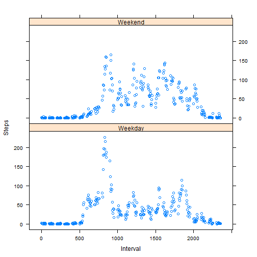

Reproducible Research- Peer Assessment 1
========================================================


### This document describes the process followed for completing the analysis required by the Peer Assessment 1 of Reproducible Research course.

First, the packages required for the project were loaded in R Studio


```r
library(plyr)
library(lattice)
library(reshape2)
library(xtable)
```


Imported the Activity Data Set in R


```r
activity_data = read.csv("activity.csv", header = TRUE)
```


### Part 1: Mean total number of steps taken per day

The first part of the analysis requires to make a histogram of the total number of steps taken each day and calculate the mean and median of total steps taken.

Created a separate data set for Part 1 with only the required columns so that original data is preserved.


```r
activity_data_2 = activity_data[, c(2, 1)]
colnames(activity_data_2) = c("Date", "Steps")
print_data = xtable(head(activity_data_2))
print(print_data, type = "html")
```

<!-- html table generated in R 3.0.3 by xtable 1.7-3 package -->
<!-- Sun May 18 21:46:27 2014 -->
<TABLE border=1>
<TR> <TH>  </TH> <TH> Date </TH> <TH> Steps </TH>  </TR>
  <TR> <TD align="right"> 1 </TD> <TD> 2012-10-01 </TD> <TD align="right">  </TD> </TR>
  <TR> <TD align="right"> 2 </TD> <TD> 2012-10-01 </TD> <TD align="right">  </TD> </TR>
  <TR> <TD align="right"> 3 </TD> <TD> 2012-10-01 </TD> <TD align="right">  </TD> </TR>
  <TR> <TD align="right"> 4 </TD> <TD> 2012-10-01 </TD> <TD align="right">  </TD> </TR>
  <TR> <TD align="right"> 5 </TD> <TD> 2012-10-01 </TD> <TD align="right">  </TD> </TR>
  <TR> <TD align="right"> 6 </TD> <TD> 2012-10-01 </TD> <TD align="right">  </TD> </TR>
   </TABLE>


Now it is required to calculate the total number of steps for each day while ignoring the missing values. Used tapply function for this. Plotted the histogram for this array.


```r
Day_Wise_Steps = tapply(activity_data_2[, 2], activity_data_2[, 1], sum, na.rm = TRUE)
hist(Day_Wise_Steps)
```

 


Since we need to use this for further computation, converted the above array to a data frame and provided appropriate column names.


```r
Day_Wise_Steps = as.table(Day_Wise_Steps)
Day_Wise_Steps = as.data.frame(Day_Wise_Steps)
colnames(Day_Wise_Steps) = c("Date", "Steps")
class(Day_Wise_Steps)
```

[1] "data.frame"

```r
print_data = xtable(head(Day_Wise_Steps))
print(print_data, type = "html")
```

<!-- html table generated in R 3.0.3 by xtable 1.7-3 package -->
<!-- Sun May 18 21:46:27 2014 -->
<TABLE border=1>
<TR> <TH>  </TH> <TH> Date </TH> <TH> Steps </TH>  </TR>
  <TR> <TD align="right"> 1 </TD> <TD> 2012-10-01 </TD> <TD align="right">   0 </TD> </TR>
  <TR> <TD align="right"> 2 </TD> <TD> 2012-10-02 </TD> <TD align="right"> 126 </TD> </TR>
  <TR> <TD align="right"> 3 </TD> <TD> 2012-10-03 </TD> <TD align="right"> 11352 </TD> </TR>
  <TR> <TD align="right"> 4 </TD> <TD> 2012-10-04 </TD> <TD align="right"> 12116 </TD> </TR>
  <TR> <TD align="right"> 5 </TD> <TD> 2012-10-05 </TD> <TD align="right"> 13294 </TD> </TR>
  <TR> <TD align="right"> 6 </TD> <TD> 2012-10-06 </TD> <TD align="right"> 15420 </TD> </TR>
   </TABLE>


Tried calculation mean steps per day using a simple mean() function, however got some error and could not resolve it. Hence used the old-fashioned way of dividing the sum by total count.


```r
Mean_Steps_per_Day = sum(Day_Wise_Steps[, 2])/length(Day_Wise_Steps[, 1])
```


Mean of steps per day was found to be 9354.2295.

Next calculation of Median was required.Total observations are 61 and hence the 30th instance in a ordered data will be median. Sorted the data in ascending order based on number of steps and obtained the 31st observation.


```r
Day_Wise_Steps_Sorted = Day_Wise_Steps[order(Day_Wise_Steps[, 2]), ]
Median_Steps_per_Day = Day_Wise_Steps_Sorted[31, 2]
```


Median of steps per day was found to be 10395


### Part 2: Average daily activity pattern

For this part, it is required to make a time series plot of the 5-minute interval (x-axis) and the average number of steps taken, averaged across all days (y-axis) and then find which 5-minute interval, on average across all the days in the data set, contains the maximum number of steps.

For this part also, missing values have to be removed.

Created a separate data set from the original activity_data data and named the columns appropriately.


```r
activity_data_3 = activity_data[!is.na(activity_data[, 1]), ]
activity_data_4 = activity_data_3[, c(3, 1)]
colnames(activity_data_4) = c("Interval", "Steps")
print_data = xtable(head(activity_data_4))
print(print_data, type = "html")
```

<!-- html table generated in R 3.0.3 by xtable 1.7-3 package -->
<!-- Sun May 18 21:46:27 2014 -->
<TABLE border=1>
<TR> <TH>  </TH> <TH> Interval </TH> <TH> Steps </TH>  </TR>
  <TR> <TD align="right"> 289 </TD> <TD align="right">   0 </TD> <TD align="right">   0 </TD> </TR>
  <TR> <TD align="right"> 290 </TD> <TD align="right">   5 </TD> <TD align="right">   0 </TD> </TR>
  <TR> <TD align="right"> 291 </TD> <TD align="right">  10 </TD> <TD align="right">   0 </TD> </TR>
  <TR> <TD align="right"> 292 </TD> <TD align="right">  15 </TD> <TD align="right">   0 </TD> </TR>
  <TR> <TD align="right"> 293 </TD> <TD align="right">  20 </TD> <TD align="right">   0 </TD> </TR>
  <TR> <TD align="right"> 294 </TD> <TD align="right">  25 </TD> <TD align="right">   0 </TD> </TR>
   </TABLE>


Calculated total of steps in each time interval. Then added another column for average steps by dividing the total steps by 61 (no of days in the data)


```r
Interval_Wise_Steps = tapply(activity_data_4[, 2], activity_data_4[, 1], sum)
Interval_Wise_Steps = as.table(Interval_Wise_Steps)
Interval_Wise_Steps = as.data.frame(Interval_Wise_Steps)
colnames(Interval_Wise_Steps) = c("Interval", "Steps")
Interval_Wise_Steps$Average_Steps = Interval_Wise_Steps$Steps/61
print_data = xtable(head(Interval_Wise_Steps))
print(print_data, type = "html")
```

<!-- html table generated in R 3.0.3 by xtable 1.7-3 package -->
<!-- Sun May 18 21:46:27 2014 -->
<TABLE border=1>
<TR> <TH>  </TH> <TH> Interval </TH> <TH> Steps </TH> <TH> Average_Steps </TH>  </TR>
  <TR> <TD align="right"> 1 </TD> <TD> 0 </TD> <TD align="right">  91 </TD> <TD align="right"> 1.49 </TD> </TR>
  <TR> <TD align="right"> 2 </TD> <TD> 5 </TD> <TD align="right">  18 </TD> <TD align="right"> 0.30 </TD> </TR>
  <TR> <TD align="right"> 3 </TD> <TD> 10 </TD> <TD align="right">   7 </TD> <TD align="right"> 0.11 </TD> </TR>
  <TR> <TD align="right"> 4 </TD> <TD> 15 </TD> <TD align="right">   8 </TD> <TD align="right"> 0.13 </TD> </TR>
  <TR> <TD align="right"> 5 </TD> <TD> 20 </TD> <TD align="right">   4 </TD> <TD align="right"> 0.07 </TD> </TR>
  <TR> <TD align="right"> 6 </TD> <TD> 25 </TD> <TD align="right"> 111 </TD> <TD align="right"> 1.82 </TD> </TR>
   </TABLE>


Plotted the graph for Average Steps against time-intervals


```r
plot(Interval_Wise_Steps$Interval, Interval_Wise_Steps$Average_Steps)
```

 


Next found out the interval which has max average steps


```r
Max_Average_Steps = max(Interval_Wise_Steps$Average_Steps)
Max_Interval = Interval_Wise_Steps[Interval_Wise_Steps$Average_Steps == Max_Average_Steps, 
    ]
```


The interval with maximum average steps is 835 and the maximum average number of steps is 179.1311

### Part 3: Missing Values

#### Total number of missing values 

Calculation of missing values number.


```r
Missing_Values_No = length(activity_data[is.na(activity_data[, 1]), 1])
```


The total number of missing values is 2304

#### Filling in all of the missing values in the dataset

Assigned appropriate column names to data and divided it into two parts
- Data with missing values
- Data without missing values


```r
colnames(activity_data) = c("Steps", "Date", "Interval")
activity_data_missing = activity_data[is.na(activity_data[, 1]), ]
activity_data_correct = activity_data[!is.na(activity_data[, 1]), ]
```


For the data with missing values, joined the table with Interval_Wise_Steps table which has column on average value of steps against each interval. 


```r
new_table = merge(activity_data_missing, Interval_Wise_Steps, by.x = "Interval", 
    by.y = "Interval", all = TRUE, sort = FALSE)
```


Now this new table has fields as below


```r
print_data = xtable(head(new_table))
print(print_data, type = "html")
```

<!-- html table generated in R 3.0.3 by xtable 1.7-3 package -->
<!-- Sun May 18 21:46:28 2014 -->
<TABLE border=1>
<TR> <TH>  </TH> <TH> Interval </TH> <TH> Steps.x </TH> <TH> Date </TH> <TH> Steps.y </TH> <TH> Average_Steps </TH>  </TR>
  <TR> <TD align="right"> 1 </TD> <TD align="right">   0 </TD> <TD align="right">  </TD> <TD> 2012-10-01 </TD> <TD align="right">  91 </TD> <TD align="right"> 1.49 </TD> </TR>
  <TR> <TD align="right"> 2 </TD> <TD align="right">   0 </TD> <TD align="right">  </TD> <TD> 2012-11-30 </TD> <TD align="right">  91 </TD> <TD align="right"> 1.49 </TD> </TR>
  <TR> <TD align="right"> 3 </TD> <TD align="right">   0 </TD> <TD align="right">  </TD> <TD> 2012-11-04 </TD> <TD align="right">  91 </TD> <TD align="right"> 1.49 </TD> </TR>
  <TR> <TD align="right"> 4 </TD> <TD align="right">   0 </TD> <TD align="right">  </TD> <TD> 2012-11-09 </TD> <TD align="right">  91 </TD> <TD align="right"> 1.49 </TD> </TR>
  <TR> <TD align="right"> 5 </TD> <TD align="right">   0 </TD> <TD align="right">  </TD> <TD> 2012-11-14 </TD> <TD align="right">  91 </TD> <TD align="right"> 1.49 </TD> </TR>
  <TR> <TD align="right"> 6 </TD> <TD align="right">   0 </TD> <TD align="right">  </TD> <TD> 2012-11-10 </TD> <TD align="right">  91 </TD> <TD align="right"> 1.49 </TD> </TR>
   </TABLE>


Rearranged the order to match the original activity data set so that combining is easier.


```r
activity_data_mod = new_table[, c(5, 3, 1)]
colnames(activity_data_mod) = c("Steps", "Date", "Interval")
print_data = xtable(head(activity_data_mod))
print(print_data, type = "html")
```

<!-- html table generated in R 3.0.3 by xtable 1.7-3 package -->
<!-- Sun May 18 21:46:28 2014 -->
<TABLE border=1>
<TR> <TH>  </TH> <TH> Steps </TH> <TH> Date </TH> <TH> Interval </TH>  </TR>
  <TR> <TD align="right"> 1 </TD> <TD align="right"> 1.49 </TD> <TD> 2012-10-01 </TD> <TD align="right">   0 </TD> </TR>
  <TR> <TD align="right"> 2 </TD> <TD align="right"> 1.49 </TD> <TD> 2012-11-30 </TD> <TD align="right">   0 </TD> </TR>
  <TR> <TD align="right"> 3 </TD> <TD align="right"> 1.49 </TD> <TD> 2012-11-04 </TD> <TD align="right">   0 </TD> </TR>
  <TR> <TD align="right"> 4 </TD> <TD align="right"> 1.49 </TD> <TD> 2012-11-09 </TD> <TD align="right">   0 </TD> </TR>
  <TR> <TD align="right"> 5 </TD> <TD align="right"> 1.49 </TD> <TD> 2012-11-14 </TD> <TD align="right">   0 </TD> </TR>
  <TR> <TD align="right"> 6 </TD> <TD align="right"> 1.49 </TD> <TD> 2012-11-10 </TD> <TD align="right">   0 </TD> </TR>
   </TABLE>


Now this new data set was joined with data without missing values to get the final data set. A check is performed on dimensions to ensure that data integrity is maintained.


```r
dim(activity_data)
```

[1] 17568     3

```r
dim(activity_data_missing)
```

[1] 2304    3

```r
dim(activity_data_correct)
```

[1] 15264     3

```r

dim(activity_data_mod)
```

[1] 2304    3

```r

activity_data_final = rbind(activity_data_mod, activity_data_correct)

dim(activity_data_final)
```

[1] 17568     3


#### Calculating new mean and median

Performed the calculation of mean and median as per before


```r

working_data = activity_data_final[, c(2, 1)]
Day_Wise_Steps_New = tapply(working_data[, 2], working_data[, 1], sum)
hist(Day_Wise_Steps_New)
```

 

```r
Day_Wise_Steps_New = as.table(Day_Wise_Steps_New)
Day_Wise_Steps_New = as.data.frame(Day_Wise_Steps_New)
colnames(Day_Wise_Steps_New) = c("Day", "Steps")
Mean_Steps_per_Day_New = sum(Day_Wise_Steps_New[, 2])/length(Day_Wise_Steps_New[, 
    1])
Day_Wise_Steps_Sorted_New = Day_Wise_Steps_New[order(Day_Wise_Steps_New[, 2]), 
    ]
Median_Steps_per_Day_New = Day_Wise_Steps_Sorted_New[31, 2]
```


The old mean was 9354.2295. The new mean is 1.0581 &times; 10<sup>4</sup> and we can see that the mean has increased. This is expected as steps are always positive and adding additional non-zero value will always increase the mean.

The old median was 10395. The new median is 1.0395 &times; 10<sup>4</sup>. It can be seen this has not changed which would imply there was no missing value for this case in the entire data set.

Let's try to verify this.


```r
Day_Wise_Steps_Sorted_New[31, ]
```

          Day Steps
20 2012-10-20 10395


The day is 2012-10-20. We should not get any missing value for this day in the activity data set.


```r
sum(is.na(activity_data[activity_data[, 2] == "2012-10-20", 1]))
```

[1] 0


It can be seen that the sum is zero. Hence the earlier case of median not changing is correct.

### Part 4: Differences in activity patterns between weekdays and weekends

Created a new column for Weekday in the activity_data_final


```r
activity_data_final$Date_Formatted = as.Date(activity_data_final[, 2])
activity_data_final$weekday = weekdays(activity_data_final$Date_Formatted)
```


Used a function to tag 'weekday' or 'weekend' 


```r
tag = function(x) 
{
    if (x == "Saturday" | x == "Sunday") 
        tag = "Weekend" else tag = "Weekday"
    tag
    
}

activity_data_final$tag = sapply(activity_data_final$weekday, tag)

print_data = xtable(head(activity_data_final))
print(print_data, type = "html")
```

```
## Warning: class of 'x' was discarded
```

<!-- html table generated in R 3.0.3 by xtable 1.7-3 package -->
<!-- Sun May 18 21:46:28 2014 -->
<TABLE border=1>
<TR> <TH>  </TH> <TH> Steps </TH> <TH> Date </TH> <TH> Interval </TH> <TH> Date_Formatted </TH> <TH> weekday </TH> <TH> tag </TH>  </TR>
  <TR> <TD align="right"> 1 </TD> <TD align="right"> 1.49 </TD> <TD> 2012-10-01 </TD> <TD align="right">   0 </TD> <TD align="right"> 15614.00 </TD> <TD> Monday </TD> <TD> Weekday </TD> </TR>
  <TR> <TD align="right"> 2 </TD> <TD align="right"> 1.49 </TD> <TD> 2012-11-30 </TD> <TD align="right">   0 </TD> <TD align="right"> 15674.00 </TD> <TD> Friday </TD> <TD> Weekday </TD> </TR>
  <TR> <TD align="right"> 3 </TD> <TD align="right"> 1.49 </TD> <TD> 2012-11-04 </TD> <TD align="right">   0 </TD> <TD align="right"> 15648.00 </TD> <TD> Sunday </TD> <TD> Weekend </TD> </TR>
  <TR> <TD align="right"> 4 </TD> <TD align="right"> 1.49 </TD> <TD> 2012-11-09 </TD> <TD align="right">   0 </TD> <TD align="right"> 15653.00 </TD> <TD> Friday </TD> <TD> Weekday </TD> </TR>
  <TR> <TD align="right"> 5 </TD> <TD align="right"> 1.49 </TD> <TD> 2012-11-14 </TD> <TD align="right">   0 </TD> <TD align="right"> 15658.00 </TD> <TD> Wednesday </TD> <TD> Weekday </TD> </TR>
  <TR> <TD align="right"> 6 </TD> <TD align="right"> 1.49 </TD> <TD> 2012-11-10 </TD> <TD align="right">   0 </TD> <TD align="right"> 15654.00 </TD> <TD> Saturday </TD> <TD> Weekend </TD> </TR>
   </TABLE>


Now used the melt and dcast functions to change the data in format required. 


```r

data_for_plot = activity_data_final[, c(3, 6, 1)]
melt_data = melt(data_for_plot, id = c("Interval", "tag"), measure.vars = "Steps")
final_data = dcast(melt_data, tag + Interval ~ variable, mean)
```


The final data to be used for plot looks like below. It is summarized based on tag and then interval and has value of average of steps for each category


```r
print_data = xtable(head(final_data))
print(print_data, type = "html")
```

<!-- html table generated in R 3.0.3 by xtable 1.7-3 package -->
<!-- Sun May 18 21:46:28 2014 -->
<TABLE border=1>
<TR> <TH>  </TH> <TH> tag </TH> <TH> Interval </TH> <TH> Steps </TH>  </TR>
  <TR> <TD align="right"> 1 </TD> <TD> Weekday </TD> <TD align="right">   0 </TD> <TD align="right"> 2.22 </TD> </TR>
  <TR> <TD align="right"> 2 </TD> <TD> Weekday </TD> <TD align="right">   5 </TD> <TD align="right"> 0.44 </TD> </TR>
  <TR> <TD align="right"> 3 </TD> <TD> Weekday </TD> <TD align="right">  10 </TD> <TD align="right"> 0.17 </TD> </TR>
  <TR> <TD align="right"> 4 </TD> <TD> Weekday </TD> <TD align="right">  15 </TD> <TD align="right"> 0.20 </TD> </TR>
  <TR> <TD align="right"> 5 </TD> <TD> Weekday </TD> <TD align="right">  20 </TD> <TD align="right"> 0.10 </TD> </TR>
  <TR> <TD align="right"> 6 </TD> <TD> Weekday </TD> <TD align="right">  25 </TD> <TD align="right"> 1.55 </TD> </TR>
   </TABLE>


Finally, created the plot using the lattice system


```r
xyplot(Steps ~ Interval | tag, data = final_data, layout = c(1, 2))
```

 


Based on this plot, it can be observed that number of steps rise to a significant value later on weekends. This is expected as people will get up late. Also, there are higher number of steps towards the end of day during weekends. So people sleep late during weekends. Another notable trend is the spike during the 8:30-9:30 time period during weekdays- this is obviously due to office commute. 

Also the weekday plot is fairly regular. So people sit in office during some period, then there is activity around lunch time, then coffee time and then while leaving office. On the other hand, there's no pattern in weekend activity.

## End of File

